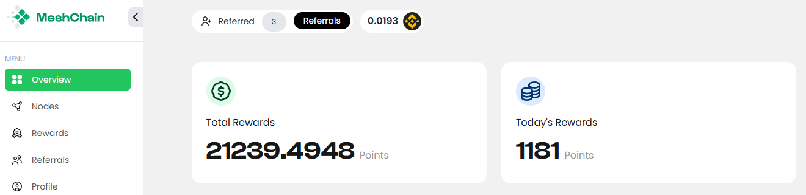
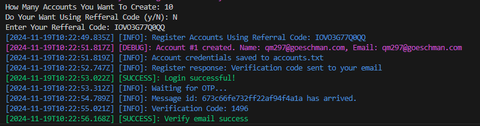

## MESHCHAIN NETWORK BOT

MeshChain is a decentralized network designed to provide affordable, scalable compute power for AI workloads. We address the high costs and limited access to AI resources, making it easier for everyone to contribute and benefit from the power of AI.

[https://app.meshchain.ai](https://app.meshchain.ai)



### Meshchain Automation Script

Solve captcha using anti-captcha [https://anti-captcha.com/](https://anti-captcha.com/)

This repository contains scripts for automating tasks such as user registration, email verification, claiming rewards, and starting mining on MeshChain.

## Features

- Support Multy accounts.
- Register new accounts.
- Verify email using OTP.
- Claim faucet BNB.
- Initialize and link unique nodes.

## Prerequisite

- Git
- Node.js (v16 or higher).
- New mail for each account (for email verification and claim faucet bnb).
- 1 account only can link with 1 nodeId so if you want farm it create multiple accounts.

## Setup

- This file while auto generate if you register using script.
- If you already have account you can create file manually.
- `token.txt`: Stores tokens in the format `access_token|refresh_token` each line 1 account.
- `unique_id.txt`: Stores unique IDs for linked nodes each line 1 account.

## Installation

1. Clone the repository:
   ```bash
   git clone https://github.com/Rambeboy/meshchain-network-bot.git && cd meshchain-network-bot
   ```

2. install dependencies:
   ```bash
   npm install
   ```

3. Configure your accounts:
   ```bash
   cp accounts/token_tmp.js token.txt && cp accounts/unique_id_tmp.js unique_id.txt
   ```

4. Register account:
   ```bash
   npm run register
   ```

5. Run the bot:
   ```bash
   npm run start
   ```

## Additional Features:

**Auto Register And Verify Using Temp Mail**
```bash
npm run autoreg
```


  

## LICENSE

This project is licensed under the MIT License. See the [LICENSE](LICENSE) file for details.
